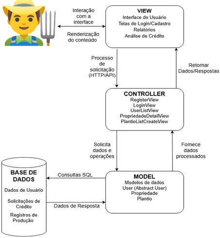
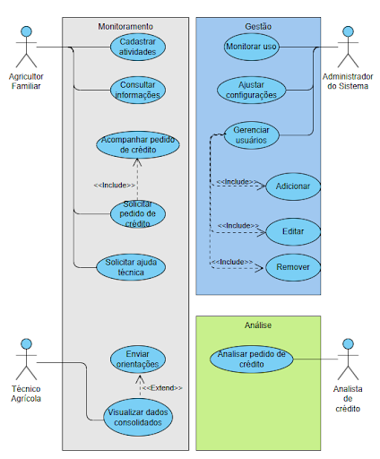
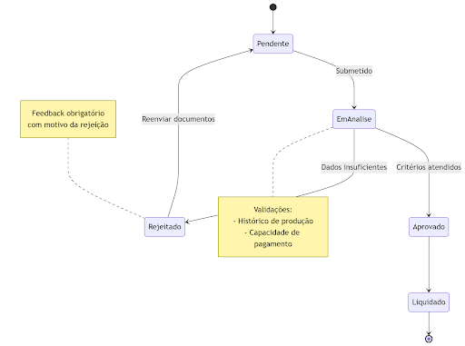
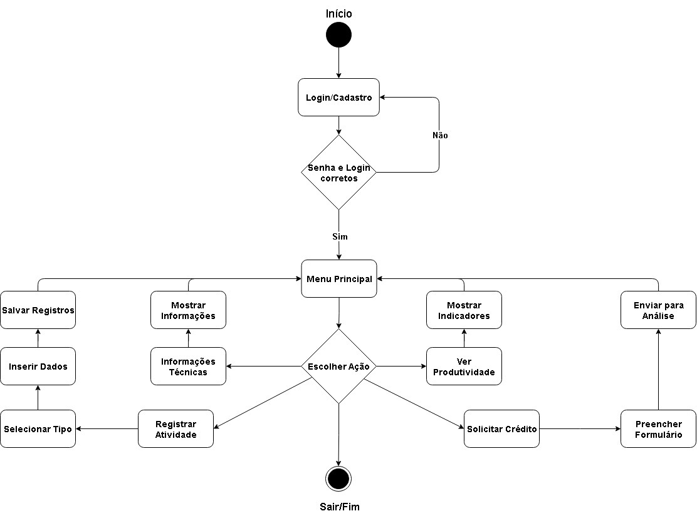
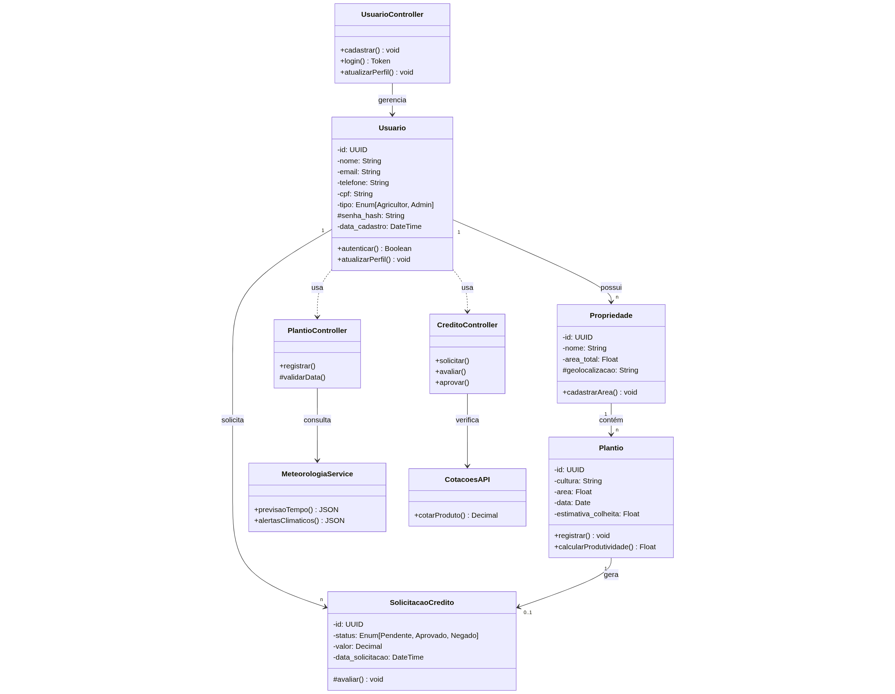
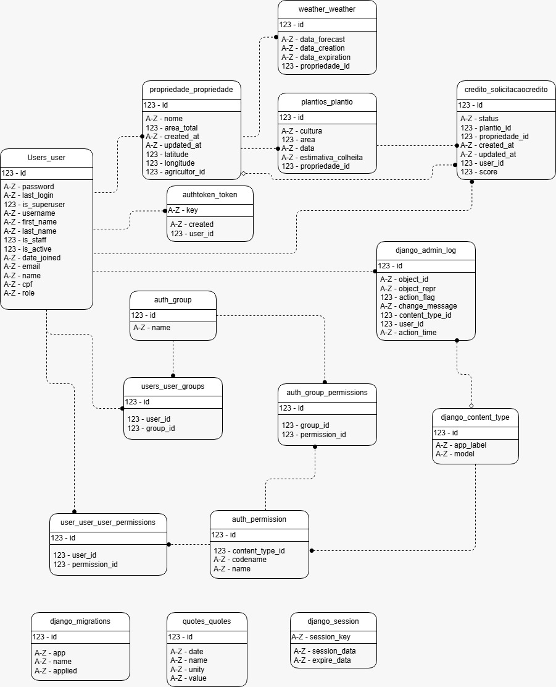
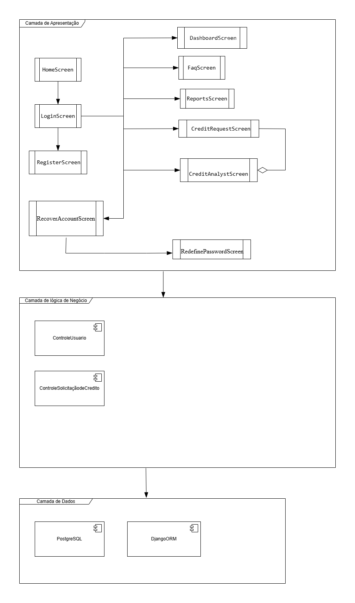

# **2. Representação Arquitetural**

## **2.1. Definições**

O sistema seguirá uma arquitetura em camadas, com o modelo arquitetural escolhido MVC (Model-View-Controller).

## **2.2. Justifique sua escolha.** 

Optamos por uma arquitetura baseada nos princípios do MVC com objetivo de manter nosso projeto devidamente organizado e visando a separação de responsabilidades, pois decidimos dividir nossa equipe em frontend e backend, então uma arquitetura que contribuísse com o sucesso de tal divisão é essencial.

Além disso, de acordo com as escolhas das tecnologias que vamos utilizar, presentes no tópico 1.4 do documento de visão: principalmente Django e React Native. Primeiro concluímos que como o Django já segue o modelo de arquitetura MVT (Model-View-Template), derivada do MVC, poderemos trabalhar com ele facilmente sem mudanças bruscas. Será principalmente por meio do Django que os conceitos de Model e Controller serão implementados. Segundo, concluímos que também conseguiremos aplicar bem essa arquitetura ao trabalhar com o React Native, já que por definição ele já cuida da interface do usuário (View).

Dessa forma, acreditamos que essa escolha será vantajosa para além da organização e separação, também esperamos que isso facilitará o desenvolvimento, manutenção, testes e possíveis alterações que ocorram no nosso projeto.

## **2.3. Detalhamento**

A arquitetura escolhida para o desenvolvimento é o MVC (Model-View-Controller). O padrão MVC favorece a separação de responsabilidades, permitindo o desenvolvimento de interface, lógica de controle e gestão de dados. Então, assegurando as vantagens destacadas no item 2.2.   
O modelo arquitetural MVC é composto de três componentes principais: Model, View e Controller. Esses elementos possuem papeis específicos, que relacionando com o aplicativo AgroRenda, são instanciados com funções diretamente ligadas às necessidades da ferramenta voltada à gestão de produção de atividades rurais.  

O Model  contém a lógica de negócio e é responsável pelo acesso e manipulação dos dados da aplicação. Ele concentra as regras de negócio e lida com o acesso e a persistência de informações, como registros de plantios, dados de produtividade, relatórios de crédito e dados de usuários.  As requisições vindas do controller são recebidas pela Model gerando respostas a partir destas requisições.  

A View é a camada encarregada da interface com o usuário, e no aplicativo, ela foi projetada com foco total em acessibilidade e usabilidade intuitiva. A interface conta com elementos visuais autoexplicativos, ícones representativos e textos reduzidos, tornando o uso acessível para pessoas com pouca familiaridade com a tecnologia. A View exibe informações de forma clara e simples, permitindo com que todas as funcionalidades 
sejam encontradas, mas sem executar qualquer lógica de processamento.   

O Controller faz a ponte entre a View e o Model. Toda vez que o usuário realiza uma ação na interface como tocar no botão “Registrar Plantio”, a View encaminha esse evento ao Controller, que interpreta a solicitação, valida os dados, interage com o Model e retorna a resposta apropriada a View.   

<b>Figura 1 - </b> Representação da Arquitetura do Sistema 

 

<b>Fonte: </b> Elaborado por Davi Leite(2025)

## **2.4. Metas e restrições arquiteturais**
  
* Disponibilidade: O sistema deve visar uma disponibilidade de 99,5%, garantindo que os dados dos usuários estejam seguros, íntegros e acessíveis sempre que necessários.  
* Padrões de codificação: O código deve seguir as melhores práticas de codificação para Python/ Django ([PEP 8](https://peps.python.org/pep-0008/)) e JavaScript/ React Native ([MDN](https://developer.mozilla.org/en-US/docs/MDN/Writing_guidelines/Code_style_guide/JavaScript)).  
* Manutenibilidade: O sistema deve ser modular e possuir baixo acoplamento entre os componentes em visão de um projeto mais fácil de se manter e realizar alterações.  
* Segurança: As APIs desenvolvidas no backend Django devem seguir as melhores práticas possíveis e passar em testes como aqueles definidos pelo [OWASP](https://owasp.org/www-project-web-security-testing-guide/stable/).  
* Versionamento: O padrão usado para realizar mudanças no código e utilizar a ferramenta Git eficientemente será o [Git Flow](https://nvie.com/posts/a-successful-git-branching-model/).

	Todos os elementos supracitados contribuem para um desenvolvimento de software ágil e eficiente, onde todos os membros do projeto estão em sincronia na codificação e nas metas a serem alcançadas. Como objetivo final, essas metas e restrições ajudam a criar um produto final confiável e uma experiência agradável para o usuário.

## **2.5. Visão de Casos de uso (escopo do produto)**

No escopo do projeto AgroRenda, o grupo optou por uma aplicação mobile voltada a atender as necessidades de pequenos produtores rurais para auxílio das atividades cotidianas, incluindo funcionalidades como: um sistema de login, sistema de registro e acompanhamento de atividades de produção; interface gráfica; acessibilidade.

Com as funcionalidades escolhidas, houve a criação de perfis e cenários nos moldes do escopo, a fim de corretamente atender às permissões e acessos reservados a cada um dos agentes abrangidos dentro do escopo do projeto, e à ordenação dos Sprints de maneira a facilitar a organização do projeto. Por fim, o grupo optou por incluir requisitos funcionais e não funcionais ao projeto, tendo cada um níveis de prioridade 

Alguns dos requisitos que contribuíram para a escolha do modelo de arquitetura MVC foram a necessidade de separação clara entre regras de negócio, interface e manipulação de dados, como evidenciado pela presença de múltiplos perfis de usuários, como agricultor, administrador e analista de crédito. Cada um deles têm responsabilidades distintas dentro do sistema e essa divisão de responsabilidades favorece o uso do modelo de  arquitetura MVC, uma vez que permite modularizar melhor as funcionalidades, garantindo que mudanças na interface não afetem a lógica do sistema.

Outro fator que influenciou na escolha do modelo de arquitetura MVC foi a separação da equipe em backend, que usará o Django, e o frontend, que fará as atividades usando o React. O modelo de arquitetura MVC também favorece a divisão de responsabilidades e a prática de Extreme Programming, XP, oferece uma proposta que engloba desenvolvimento incremental, testes e refatoração de forma contínua, que cabe bem na organização em camadas do MVC

<b>Figura 2 - </b> Diagramas de Casos de Uso 

 

<b>Fonte: </b> Elaborado por Davi Coelho(2025)

## **2.6. Visão lógica**

Como mencionado previamente, o sistema AgroRenda é organizado em módulos seguindo o padrão MVC (Model-View-Controller), com foco em usabilidade para agricultores familiares. Abaixo está a estrutura lógica detalhada:

### **2.6.1. Módulos do Sistema**

* **A. Módulo de Autenticação**  
    * **Razão Lógica:** Gerencia cadastro, login e segurança (criptografia de senhas).  
    * **Componentes:**  
        * **Model:** User (dados do usuário).  
        * **View:** Telas de login/cadastro.  
        * **Controller:** AuthController (valida credenciais, gerencia sessões).

* **B. Módulo de Gestão Agrícola**  
    * **Razão Lógica:** Permite registrar e acompanhar atividades (plantio, colheita e vendas).  
    * **Componentes:**  
        * **Model:** Production, Crop, Livestock.  
        * **View:** Telas de formulários e relatórios.  
        * **Controller:** ProductionController (CRUD de atividades).

* **C. Módulo de Crédito Rural**  
    * **Razão Lógica:** Facilita solicitação e acompanhamento de crédito.  
    * **Componentes:**  
        * **Model:** CreditRequest  
        * **View:** Formulários de solicitação e status.  
        * **Controller:** CreditController (integra com APIs de análise).

* **D. Módulo de Conteúdo Educacional**  
    * **Razão Lógica:** FAQs para capacitação.  
    * **Componentes:**  
        * **Model:** EducationalContent  
        * **View:** Listagem de FAQs.  
        * **Controller:** ContentController (intermedia a comunicação entre o modelo e a visualização do conteúdo educacional).

* **E. Módulo de Administração**  
    * **Razão Lógica:** Gerencia usuários e configurações do sistema.  
    * **Componentes:**  
        * **Model:** AdminSettings  
        * **View:** Painel de administração.  
        * **Controller:** AdminController (atribui perfil analista).

### **2.6.2. Comunicação entre Módulos (Interfaces)**

* **APIs REST:** Backend (Django) expõe endpoints como /api/production para o frontend (React Native).  
* **Eventos:** Solicitação de crédito gera notificação para o módulo de administração.  
* **Banco de Dados:** SQLite compartilhado entre módulos (como por exemplo: tabela users usada por autenticação e administração).

### **2.6.3. Diagrama de Estados**

A seguir, temos ilustrado o diagrama de estados da aplicação, que representa o ciclo de vida das solicitações de crédito no sistema AgroRenda. Este diagrama demonstra os diferentes estágios do processo - desde a submissão inicial até a aprovação ou rejeição final - bem como as condições que determinam as transições entre esses estados. Através desta representação visual, é possível compreender o fluxo completo de funcionamento desta funcionalidade central do sistema, incluindo os caminhos alternativos que podem ocorrer durante a análise das solicitações.

<b>Figura 3 - </b> Diagrama de Transição de Estados 

 

<b>Fonte: </b> Elaborado por Davi Leite(2025)

### **2.6.4. Diagrama de Atividades**

Complementando a visão geral do sistema, o diagrama de atividades apresentado detalha o fluxo operacional completo da aplicação, demonstrando passo a passo as interações do usuário e as respostas do sistema em cada estágio do processo. O diagrama esclarece tanto o fluxo principal de registro de plantio quanto todos os caminhos alternativos que podem ocorrer durante a utilização da plataforma, incluindo tratamentos de erro, validações automáticas e processos paralelos que garantem o funcionamento integrado do AgroRenda. Através desta representação visual, se torna mais evidente como o sistema se comporta em diferentes cenários de uso, desde condições ideais até situações excepcionais que demandam intervenções específicas.

<b>Figura 4 - </b> Diagrama de Atividades 

 

<b>Fonte: </b> Elaborado por Davi Coelho(2025)

### **2.6.5. Diagrama de Classes**

O diagrama de classes apresentado a seguir ilustra a estrutura básica do sistema AgroRenda, mostrando os principais componentes e como eles se relacionam entre si. Essa representação permite visualizar os elementos fundamentais que compõem a aplicação, incluindo as entidades principais, suas características e as conexões existentes. 
	

<b>Figura 5 - </b> Diagrama de Classes 

 

<b>Fonte: </b> Elaborado por Pedro Sanchez e Davi Coelho(2025)

## 2.7. **Visão de Implementação** 

### **2.7.1. Camada de Apresentação**

A camada de apresentação do sistema **AgroRenda** é responsável por garantir a comunicação visual e interativa entre o usuário final, como agricultores familiares, técnicos e analistas, e as funcionalidades oferecidas pela aplicação. O sistema será desenvolvido utilizando **React** com o framework **Expo(javascript)**, proporcionando uma interface moderna, responsiva e voltada para o uso de dispositivos móveis.

Essa camada será responsável por interagir diretamente com os usuários do sistema, permitindo que agricultores familiares, técnicos e analistas acessem funcionalidades essenciais como autenticação, registro de atividades agrícolas, solicitação de crédito, consulta de informações técnicas e geração de relatórios de produtividade, por meio de uma interface acessível, responsiva e adaptada à realidade digital dos pequenos produtores.

No projeto, a interface do usuário foi desenvolvida com componentes React, substituindo os templates HTML. Esses componentes, combinados com arquivos de estilo (CSS), scripts em JavaScript e elementos visuais como imagens e ícones, formam a base visual da aplicação, aproveitando os recursos oferecidos pelo Expo para uma integração eficiente e moderna. 

A estrutura da interface foi organizada de maneira modular, com uma divisão clara entre os componentes reutilizáveis, as telas principais, os arquivos estáticos e os serviços de comunicação com o back-end. Essa forma de organizar o código torna o sistema mais limpo, fácil de manter e pronto para crescer com novas funcionalidades no futuro

#### **2.7.1.1. Estrutura da Interface**

A camada está organizada nos seguintes diretórios principais:

* screens/: Contém as **telas funcionais** que representam cada uma das seções do aplicativo, como:

  * HomeScreen.js: Tela inicial com informações introdutórias e tutorial de uso.  
  * LoginScreen.js, RegisterScreen.js: Telas de autenticação do usuário.  
  * RecoverAccountScreen.js: Página para solicitar o envio de um e-mail de recuperação de senha.  
  * RedefinePasswordScreen.js: Página para redefinição de senha.  
  * DashboardScreen.js: Painel principal para o agricultor acompanhar sua produção.  
  * CreditRequestScreen.js: Tela de solicitação e acompanhamento de crédito para o agricultor .  
  * ReportsScreen.js: Tela de visualização dos relatórios de produtividade e histórico para o agricultor.  
  * FaqScreen.js: Página de perguntas frequentes.  
  * CreditAnalystScreen.js: Tela de análise das solicitações de crédito pelo analista financeiro.   

* components/: Contém **componentes reutilizáveis** como botões, cards, gráficos, inputs e menus.

* assets/: Contém **recursos estáticos** como:

  * img/: Ícones, logotipos e ilustrações.  
  * fonts/: Fontes personalizadas.  
  * videos/: Tutoriais explicativos.

* styles/: Contém os **estilos visuais** utilizados pelos componentes e telas.

* services/: Camada responsável por realizar as **requisições HTTP** à API back-end construída em Django REST Framework, como login, envio de formulários e recuperação de dados.

#### **2.7.1.2. Comunicação com o Back-End**

A comunicação entre o front-end e o back-end será feita por meio de **requisições HTTP**, garantindo uma integração segura e eficiente com os dados gerenciados pela API do Django. O Django, por sua vez, se conectará a um banco de dados **SQLite**, onde todas as informações da aplicação serão armazenadas e gerenciadas de forma segura e escalável.

### **2.7.2. Lógica e Regras de Negócios**

Essa camada é responsável pelas regras que definem como o sistema funciona e como ele se comunica com os usuários e os dados. No AgroRenda, ela abrange as principais funcionalidades que ajudam na gestão da produção agrícola e no acesso ao crédito. Também garante que o sistema seja seguro e fácil de usar. As regras de negócio são implementadas nos modelos de dados e nas rotinas que executam as operações do sistema, validando as informações e assegurando que tudo funcione da forma correta.  Abaixo, são detalhadas as principais áreas da lógica de negócios implementadas.

#### **2.7.2.1. Modelos:**

* **Usuário (Agricultor, Administrador, Analista de Crédito):** A aplicação define perfis distintos, cada um com permissões específicas.  
* **Atividades de Produção:** Modelo que armazena informações sobre cultivos, colheitas, vendas e outras atividades relacionadas à produção rural.   
* **Solicitações de Crédito:** Estrutura que gerencia os pedidos realizados pelos agricultores, acompanhando o status e permitindo a análise pelo Analista de Crédito.

#### **2.7.2.2. Formulários:**

* **Cadastro e Login:** A lógica implementa validações de campos obrigatórios, verificação de unicidade por meio do *e-mail* e segurança por meio de criptografia de senhas.

* **Gestão da Produção:** Formulários intuitivos permitem que agricultores registrem, editem ou excluam atividades produtivas, com campos padronizados para garantir a consistência das informações.

* **Solicitação de Crédito:** Formulário estruturado para envio de informações essenciais ao pedido, como tipo de cultivo, produtividade estimada e necessidade de financiamento.

#### **2.7.2.3. Recuperação de Conta:**

* **Fluxo de Recuperação:** Está prevista a possibilidade de redefinição de senha por meio de validação de dados de autenticação. 

#### **2.7.2.4. Controle de Acesso:**

* **Permissões de Perfis:** Cada perfil possui permissões definidas:

  * Agricultor: registro e acompanhamento de produção, solicitação de crédito, solicitação de ajuda técnica.

  * Administrador: gerenciamento geral do sistema.

  * Analista: análise de solicitações de crédito.

* **Fluxo de Acesso:** Utiliza middleware ou decorators para garantir que o usuário tenha as permissões necessárias para acessar determinadas rotas ou funcionalidades.

### **2.7.3. Comunicação com o Banco de Dados**

A comunicação com o banco de dados no sistema AgroRenda é realizada através do **Django ORM**, proporcionando uma interface de alto nível para interação com os dados, sem a necessidade de escrever consultas SQL manualmente.

#### **2.7.3.1. Estrutura do Banco de Dados:**

O banco de dados armazena informações essenciais para a operação da aplicação, com destaque para:

* **Usuários e Perfis:** Cada usuário possui atributos como nome, e-mail, e permissões específicas associadas a seu perfil (Agricultor, Administrador, Analista).  
* **Dados de Produção:** Registros das atividades agrícolas como plantio, colheita, e vendas, permitindo o acompanhamento e a geração de relatórios produtivos.  
* **Solicitações de Crédito:** Armazena os dados relacionados às solicitações feitas pelos agricultores e as análises realizadas pelos analistas.

O Django ORM gerencia automaticamente a criação das tabelas e colunas a partir dos modelos Python definidos, realizando migrações conforme alterações no esquema de dados.

#### **2.7.3.2. Operações com o Banco de Dados:**

* **Criação:** Ao registrar um novo usuário ou atividade, os dados são adicionados ao sistema e armazenados no banco de dados por meio dos métodos .add() e .save(), garantindo que as informações sejam armazenadas corretamente.

* **Leitura:** As informações são recuperadas utilizando métodos como .filter(), .get() e .all(), permitindo consultar, por exemplo, todas as atividades de um agricultor ou os pedidos de crédito pendentes.  
* **Atualização:** Para modificar informações, como atualização de status de uma solicitação de crédito, utiliza-se o método .update() ou atribuições diretas seguidas de .save().  
* **Exclusão:** A exclusão de registros pode ser realizada com o método .delete().

#### **2.7.3.3. Validações e Integridade:**

O Django fornece validações automáticas de tipo e integridade referencial:

* **Validação de campos obrigatórios**: E-mail e senha.  
* **Relacionamentos entre modelos**: Um agricultor vinculado a várias Atividades de Produção.  
* **Integridade transacional**: Garantir que operações complexas sejam atômicas.

#### **2.7.3.4. Consultas Simples e Complexas:**

* **Consultas Simples:** Recuperação, por exemplo, de todas as atividades de um agricultor em determinada safra.  
* **Consultas Agregadas:** Cálculo de produtividade média, total de vendas ou volume de crédito solicitado.

#### **2.7.3.5. Padrão de Desenvolvimento:**

* A lógica de negócio segue o padrão **MTV (Model-Template-View)** do Django, promovendo uma separação clara entre a modelagem de dados, a lógica de aplicação e a interface com o usuário.  
* O banco de dados utilizado será **SQLite**, conforme especificado no documento, garantindo robustez, segurança e suporte a operações complexas como consultas geoespaciais, caso necessário.

<b>Figura 6 - </b> Diagrama de Banco de Dados 

 

<b>Fonte: </b> Elaborado por Davi Leite(2025) 

 

<b>Figura 7 - </b> Diagrama de Pacotes 

 

<b>Fonte: </b> Elaborado por Geovanna Umbelino, Camila Cavalcante e Luísa Ferreira(2025) 

## **2.8. Visão de Implantação** 

Como já discutimos em alguns tópicos, serão utilizadas as tecnologias React Native com framework Expo para o desenvolvimento da interface, na linguagem JavaScript, atendendo nossos requisitos para implementação de uma interface para celulares. Para o backend utilizamos Django com Django Rest Framework, na linguagem Python, por meio de APIs RESTful interagimos com a interface e mantemos responsabilidades separadas de acordo com nossa arquitetura. O banco de dados em PostgreSQL, pois é muito robusto, provendo performances e funcionalidades que atendem nosso projeto. Faremos integração por meio do Django ORM (Object-Relational Mapper), de forma a simplificar interações com o banco de dados. Essas tecnologias e outras menos relevantes também são citadas no nosso documento de visão.

## **2.9. Restrições adicionais**

Este aplicativo foi projetado para atender a uma série de restrições adicionais que garantem sua qualidade, segurança, facilidade de uso e adequação ao público de pequenos produtores rurais. A seguir, são descritas essas restrições de forma objetiva.

### **2.9.1. Facilidade de uso**

O aplicativo será utilizado por pequenos produtores, muitos deles com pouca familiaridade com tecnologia. As telas devem ter uma linguagem clara, botões destacados e fluxos de navegação diretos.

Segundo a norma ISO 9241-210 (INTERNATIONAL ORGANIZATION FOR STANDARDIZATION, 2010), sistemas voltados para usuários não especializados devem priorizar a facilidade de aprendizado e a eficiência no uso. Por isso, o tempo médio para aprender a utilizar o aplicativo deve ser de, no máximo, 30 minutos.

### **2.9.2. Segurança dos dados**

Como o aplicativo irá coletar dados das plantações e informações pessoais dos produtores, é essencial proteger essas informações. Todo envio de dados será realizado com conexão segura, utilizando técnicas de criptografia. O acesso será feito mediante senha pessoal, evitando o uso não autorizado.

Essas medidas seguem boas práticas de segurança recomendadas pela Open Web Application Security Project – OWASP (2023) para aplicativos móveis.

