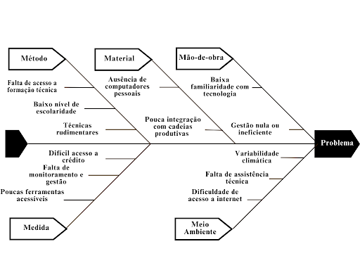

# **1. Visão Geral do Produto**

## **1.1 Problema**

**Contexto**

O Objetivo de Desenvolvimento Sustentável (ODS) 2.3, estabelecido pela Organização das Nações Unidas (ONU), visa, até 2030, dobrar a produtividade e a renda dos pequenos produtores de alimentos, especialmente agricultores familiares, mulheres do campo, povos indígenas e pescadores artesanais. Esses produtores enfrentam inúmeros desafios relacionados à falta de acesso à tecnologia, aos insumos, ao crédito e ao conhecimento técnico, o que limita o desenvolvimento sustentável e o crescimento econômico desses grupos.

**Problema**

Apesar da sua relevância socioeconômica, muitos pequenos produtores ainda utilizam técnicas rudimentares de cultivo, baseando suas atividades majoritariamente na experiência empírica adquirida ao longo da vida, com pouco ou nenhum acesso à formação técnica ou administrativa (ALVES, 2004; EPAGRI, 2005). Essa realidade está associada a fatores como o baixo nível de escolaridade e a limitada qualificação profissional, que dificultam a adoção de práticas de gestão mais eficazes e o uso de tecnologias voltadas ao aumento da produtividade.  
A baixa integração dos pequenos produtores com cadeias produtivas e suas dificuldades de acesso a mercados organizados comprometem significativamente o desenvolvimento dos seus empreendimentos. Muitos não possuem capacidade produtiva suficiente para atender à demanda de agroindústrias ou se inserir de forma estruturada em canais de distribuição, como apontam Borges, Guedes e Castro (2015). Além disso, embora existam tecnologias da informação voltadas para a agricultura, sua acessibilidade ainda é dispersa e pouco alinhada às necessidades reais da agricultura familiar, o que limita o uso dessas ferramentas para fins de gestão e obtenção de crédito (DEPONTI, 2014 apud AFFONSO et al., 2015).  
Embora existam tecnologias e softwares voltados para a agricultura, muitos produtores enfrentam barreiras no acesso e uso dessas soluções, seja por limitações de infraestrutura (como a ausência de computadores pessoais), seja pela falta de familiaridade com programas e equipamentos. Em diversos casos, quando realizam alguma forma de gestão, ela tende a ser simplificada e de baixa efetividade, por falta de monitoramento. Essa realidade reflete a falta de compreensão sobre a importância desses registros, o que impacta diretamente a eficiência gerencial das propriedades (BATALHA; BUAINAIN; SOUZA FILHO, 2005 apud AFFONSO et al., 2015).  
Embora muitos pequenos produtores enfrentem dificuldades no acesso a tecnologias mais avançadas e softwares específicos, as planilhas eletrônicas são eventualmente mencionadas como uma alternativa viável para o controle básico da propriedade rural. Essa solução se mostra acessível, especialmente por meio de versões open source, e tem potencial para contribuir com a organização das atividades e a redução da assimetria informacional no contexto da agricultura familiar. Como afirmam Affonso, Hashimoto e Sant’Ana (2015), o uso de planilhas apresenta-se como uma opção possível para apoiar a gestão, mesmo diante das barreiras tecnológicas enfrentadas por esses agricultores. Ainda assim, a ausência de uma ferramenta mais completa, apropriada e adaptada às necessidades reais do produtor limita significativamente sua capacidade de comprovar desempenho produtivo e dificulta o acesso a crédito, apoio técnico e programas de fomento.

### **Necessidade identificada**

Diante das limitações enfrentadas pelos produtores rurais em relação ao uso da tecnologia, torna-se essencial o desenvolvimento de uma ferramenta digital que seja verdadeiramente adaptada à sua realidade. Essa solução deve permitir o registro das atividades no campo, o acompanhamento da produtividade e a geração de dados que possam ser utilizados como suporte na busca por crédito e assistência técnica.   
Para ser efetiva, a ferramenta precisa superar as barreiras de acesso, como por exemplo, o baixo nível de letramento digital da maioria dos usuários alvo e compreender a resistência inicial ao uso de tecnologia (BORGES; GUEDES; CASTRO, 2015). Além disso, é preciso superar a usabilidade oferecendo uma interface compatível com o nível de familiaridade desses usuários com recursos digitais. Dessa forma, os produtores poderão não apenas controlar e planejar melhor sua produção, mas também contar com informações organizadas e confiáveis, capazes de embasar decisões e facilitar o acesso a oportunidades de apoio institucional. 

**Solução proposta**

A solução proposta consiste no desenvolvimento de uma ferramenta digital móvel, de baixo custo e alta usabilidade, voltada para a gestão simplificada de propriedades rurais familiares. O sistema será especialmente projetado para pequenos produtores com baixo letramento digital, permitindo o registro cotidiano de atividades agrícolas, o acompanhamento da produtividade e a geração automatizada de relatórios e indicadores úteis para fins de crédito, assistência técnica e apoio à tomada de decisão.  
A aplicação será construída com uma interface visual intuitiva, portanto, as telas serão projetadas de forma que a navegação, os ícones, os botões e os fluxos de interação sigam a lógica natural do comportamento humano, ou seja, o usuário "sabe o que fazer" apenas olhando a tela uso reduzido de texto, ícones autoexplicativos e navegação guiada, favorecendo seu uso por pessoas com pouca familiaridade com dispositivos eletrônicos, as características: 

1. Organização clara: os elementos são dispostos de forma lógica (ex: menus bem posicionados, agrupamento por função);

2. Ícones e rótulos auto explicativos: o que aparece na tela já comunica sua função (ex: ícone de “lixeira” para apagar, “lápis” para editar);

3. Consistência visual: cores, botões e fontes seguem o mesmo padrão em todas as telas;

4. Feedback imediato: ao clicar, o sistema responde rapidamente com uma mensagem ou animação (ex: “Salvo com sucesso”);

5. Fluxo natural de tarefas: o usuário consegue completar uma ação sem ficar perdido ou precisar de ajuda externa;

6. Minimiza texto e complexidade: usa linguagem simples e, quando possível, imagens ou ilustrações.

   

   Um exemplo prático de interface visual intuitiva pode ser observado quando um agricultor abre a distribuição web e se depara com três botões grandes, cada um acompanhado de um ícone representativo e de um texto direto: "Registrar plantio", "Ver produtividade" e "Relatório de crédito". Mesmo sem familiaridade com tecnologia, ele consegue compreender rapidamente a função de cada botão, pois o tamanho favorece a visualização e o toque, os ícones ilustram claramente a ação correspondente, os textos são objetivos e a disposição dos elementos segue uma ordem lógica de uso, alinhada ao fluxo das atividades agrícolas. Essa organização reduz a necessidade de instruções e torna a navegação mais natural e acessível. 

   Essa abordagem é fundamental diante da constatação de que muitos agricultores familiares não compreendem a utilidade dos registros das atividades rurais e apresentam dificuldades com o uso de sistemas digitais complexos (BORGES; GUEDES; CASTRO, 2015; DEPONTI, 2014). 

   O foco da solução está em atender produtores que utilizam métodos empíricos de gestão, geralmente limitados a anotações manuais ou planilhas isoladas, sem integração dos dados ou geração de relatórios estruturados. Como apontam Affonso et al. (2015), o uso de planilhas eletrônicas já representa um avanço importante na organização das atividades rurais, sendo uma alternativa viável à ausência de ferramentas mais sofisticadas. 

   Além disso, a ferramenta será acompanhada de materiais de apoio práticos e de fácil compreensão, como vídeos curtos, tutoriais ilustrados e cartilhas impressas, contribuindo para reduzir a resistência inicial à adoção tecnológica. Essa estratégia dialoga com os princípios da Informática Comunitária, que defende o uso de tecnologias acessíveis como instrumentos de empoderamento e redução da assimetria informacional no meio rural (AFFONSO et al., 2015; CASTELL, 1999).

   A proposta prevê também parcerias com instituições de extensão rural, cooperativas e universidades, de forma a viabilizar capacitação continuada dos produtores e integração dos dados coletados pela ferramenta aos processos já existentes de assistência técnica. Isso favorece a articulação entre saber técnico e saber local, ampliando a efetividade do sistema (DEPONTI, 2014).

   Com essa solução, espera-se contribuir de forma direta para:

1) A redução da exclusão digital no campo;  
2) O fortalecimento da gestão e da organização da produção agrícola familiar;  
3) O avanço rumo ao cumprimento da meta do Objetivo de Desenvolvimento Sustentável (ODS) 2.3, ao oferecer meios concretos para o aumento da produtividade e da renda dos pequenos produtores (ONU, 2015).

## **1.2 Declaração de posição do produto**

| Elemento | Declaração |
| :---- | :---- |
| **Para:** | Pequenos produtores de alimentos em situação de vulnerabilidade (agricultores familiares, pescadores artesanais, comunidades indígenas e quilombolas). |
| **Necessidade:** | Ferramenta de gestão da produção, de forma acessível, para melhorar a renda e produtividade. |
| **O produto:** | *AgroRenda* é uma aplicação web responsiva. |
| **Que:** | Permite aos produtores registrarem sua produção, acompanharem seu desempenho, receberem dicas personalizadas e se conectarem com oportunidades de apoio. |
| **Ao contrário:** | Da informalidade e da exclusão tecnológica, que dificultam o desenvolvimento sustentável desses produtores. |
| **Nosso produto:** | É intuitivo, gratuito, sustentável, com foco na inclusão produtiva e na autonomia do produtor. |

## **1.3 Objetivos do produto**

## **Objetivo principal**

Desenvolver uma solução tecnológica acessível que promova o aumento da produtividade e da renda dos pequenos produtores, com base no ODS 2.3, por meio da inclusão digital e do acompanhamento sistemático da produção agrícola.

## **Objetivos secundários**

* Facilitar o registro e o acompanhamento da produção agrícola ao longo do tempo;  
* Estimular a adoção de boas práticas produtivas;  
* Possibilitar o acesso a relatórios e históricos úteis para obtenção de crédito ou apoio técnico;  
* Garantir usabilidade mesmo para produtores com baixa familiaridade com tecnologia;  
* Fortalecer o vínculo entre o produtor e iniciativas de apoio, como cooperativas, programas governamentais e ONGs.

## **1.4 Tecnologias a serem utilizadas**

**Front-end:**

* React (JavaScript)

**Back-end:**

* Python com o framework Django

**Banco de dados:**

* PostgreSQL

**Ambiente de desenvolvimento:**

* VSCode (Visual Studio Code)

**Métodos:**

* Scrum adaptado e XP

**Técnicas:**

* Programação em pares  
* Revisão de código  
* Versionamento com Git:  
* Testes Unitários e de Integração:

**Ferramentas Adicionais:**

* Github pages para documentação  
* Whatsapp  
* Microsoft Teams  
* Notion   
* Discord