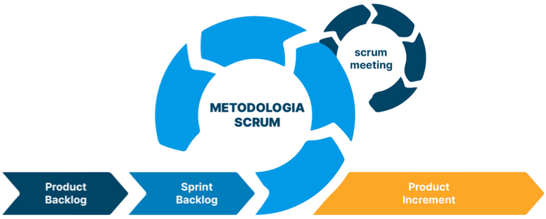

# **2. Visão Geral do Projeto**

## **2.1 Ciclo de vida do projeto de desenvolvimento de software**

A Figura 2 apresenta o ciclo de vida adotado no projeto AgroRenda, baseado no framework Scrum.

<b>Figura 2 - </b> Ciclo de vida do projeto utilizando o framework Scrum

 

<b>Fonte:</b> Adaptado de Runrun.it (2025)

Para o desenvolvimento do projeto AgroRenda, será adotada a metodologia ágil adaptada, utilizando uma abordagem híbrida que combina os frameworks Scrum e XP (Extreme Programming). Essa escolha está alinhada com os objetivos do projeto, o perfil da equipe e o contexto social da solução proposta, voltada a pequenos produtores rurais em situação de vulnerabilidade, em consonância com o ODS 2.3 da ONU.

A aplicação do Scrum permitirá a organização do trabalho em sprints curtas e entregas incrementais, facilitando a adaptação contínua às necessidades dos usuários. Já o XP será incorporado com foco em práticas de engenharia de software que aumentem a qualidade do código e a colaboração da equipe, como pair programming, refatoração contínua, feedback rápido e integração contínua.

Além disso, serão realizadas reuniões semanais com a presença obrigatória de todos os participantes do projeto, assegurando alinhamento contínuo, identificação precoce de impedimentos e reforço do comprometimento coletivo com as metas da sprint.

<b>Tabela 2 - Elementos do processo de desenvolvimento adotado no projeto AgroRenda</b> 

| Elemento | Descrição aplicada ao projeto AgroRenda |
| :---- | :---- |
| **Metodologia** | Metodologia Ágil adaptada com combinação dos frameworks Scrum e XP. |
| **Processo** | Sprints com planejamento, execução, revisão e retrospectiva; integração de boas práticas de programação. |
| **Procedimentos** | Reuniões semanais, prototipação, testes iterativos, documentação contínua, validação de funcionalidades. |
| **Métodos** | Scrum, XP, programação em pares. |
| **Ferramentas** | GitHub, Visual Studio Code, Google Docs, Microsoft Teams, Notion, WhatsApp |

<b>Fonte: </b> Renan Reis(2025)

A combinação entre Scrum e XP proporciona uma base sólida para o desenvolvimento ágil, garantindo entregas frequentes, envolvimento ativo dos membros da equipe e foco contínuo na qualidade técnica do produto. Dessa forma, o projeto *AgroRenda* poderá evoluir de forma estruturada, participativa e alinhada com os objetivos sociais propostos.

## **2.2 Organização do Projeto**

A organização do projeto AgroRenda foi estruturada com base em uma divisão clara de papéis e responsabilidades, sem qualquer relação de hierarquia entre os membros. Todos os integrantes são considerados igualmente importantes para o sucesso do projeto e contribuem conforme suas habilidades técnicas, experiência e disponibilidade.

A equipe foi distribuída em áreas funcionais (backend, frontend, banco de dados, testes e gestão), promovendo a colaboração entre os setores, especialmente entre backend e banco de dados, que compartilham a responsabilidade de integração entre lógica de negócio e persistência de dados. As funções de liderança e validação estão centradas nas figuras do Scrum Master e Product Owner, garantindo a fluidez do processo e o alinhamento com os objetivos do ODS 2.3.

<b>Tabela 3 -  Distribuição de papéis, atribuições e responsabilidades da equipe</b>

| Papel | Atribuições | Responsável | Participantes |
| :---- | :---- | :---- | :---- |
| Scrum Master | Facilitar o processo ágil,organizar reuniões,remover impedimentos, revisar entregas | Renan Reis |  |
| Product Owner | Definir e priorizar o backlog,validar entregas,representar o cliente e garantir o foco no ODS | Davi do Egito  |  |
| Dev.Backend | Implementar regras de negócio,criar e integrar APIs,colaborar com o banco de dados | Marcos Vinícius | Carlos Henrique, Yogi Nam, Marcos Vinícius, Arthur Moreira |
| Banco deDados | Modelagem de dadosqueries,persistência e integração com backend | Pedro Teixeira | Pedro Teixeira, Davi Leite |
| Dev.Frontend | Criar interfaces acessíveis, responsivas e centradas no usuário final (pequeno produtor) | Geovanna Umbelino | Geovanna Umbelino, Luísa Ferreira, Camila Cavalcante |
| Testes e Qualidade | Garantir funcionamento do sistema,criar e executar testes,validar critérios de aceitação | Milena Simões | Milena Simões, Renan Reis, Davi do Egito |

<b>Fonte: </b> Elaborado Renan Reis(2025)
   

## **2.3 Planejamento das Fases e/ou Iterações do Projeto**

O desenvolvimento do projeto AgroRenda será estruturado em sprints, com entregas incrementais e foco contínuo na geração de valor ao usuário final. Cada sprint contempla entregáveis específicos, prazos definidos e responsáveis atribuídos, de acordo com o progresso do projeto e as prioridades definidas pelo Product Owner.

O planejamento será atualizado ao longo do desenvolvimento, conforme surgirem novas necessidades, validações e riscos. A seguir, apresenta-se a previsão inicial das sprints do projeto:

<b>Tabela 4 - Planejamento das sprints do projeto AgroRenda </b> 

|  Sprint | Produto (Entrega) | Data Início | Data Fim | Entregável(eis) | Responsáveis | % conclusão |
| ----- | ----- | ----- | ----- | ----- | ----- | ----- |
| Sprint 1 | Definição do Produto | 15/05/25 | 21/05/25 | Documento de visão revisado e completo | Todos os integrantes | 100% |
| Sprint 2 | Arquitetura do produto |  15/05/25 |  28/05/25 | Documento de Arquitetura pronto e revisado  | Todos os Integrantes |  100% | 
| Sprint 3 | Autenticação e Registro de Usuário, Documentação e Organização | 08/06/25 | 15/06/25 | Funcionalidades feitas e testadas Documentos revisados | Todos os integrantes | 100% |
| Sprint 4 | License, papéis de usuário, previsão do tempo, telas, solicitação de crédito, testes| 15/06/25 | 22/06/25 | Funcionalidades feitas e testadas | Todos os integrantes | 100% |
| ... | ... | ... | ... |  |  |  |

<b>Fonte:</b> Elaborado por Renan Reis(2025)

## **2.4 Matriz de comunicação**

A comunicação do projeto AgroRenda será organizada de forma clara e periódica, com foco em garantir alinhamento entre os membros da equipe, acompanhamento das atividades, detecção de riscos e validação das entregas. Todas as interações seguirão os princípios da transparência e colaboração previstos nas metodologias ágeis utilizadas.

A equipe realizará uma reunião geral semanal, com presença obrigatória de todos os integrantes, incluindo Scrum Master, Product Owner, QA e desenvolvedores. Outras comunicações ocorrerão conforme necessidade, utilizando canais como WhatsApp, Notion, Google Docs, Microsoft Teams e GitHub.

<b>Tabela 5 - Matriz de comunicação do projeto(2025)</b>

| Descrição | Área/ Envolvidos | Periodicidade | Produtos Gerados |
| :---- | :---- | :---- | :---- |
| Reunião geral de acompanhamento | Toda a equipe | Semanal | Ata de reunião, atualização do status |
| Comunicação com o monitor | Scrum Master, PO | Conforme necessidade  | Relatório de status do projeto e esclarecimento de impedimentos |
| Alinhamento sobre critérios de aceite | PO, QA, desenvolvedores | Ao final de cada sprint | Critérios definidos e documentados |
| Atualizações internas rápidas | Toda a equipe | Contínua (WhatsApp) | Notificações, lembretes, decisões rápidas |

<b>Fonte: </b>Elaborado por Renan Reis(2025)

>

## **2.5 Gerenciamento de Riscos**

O gerenciamento de riscos do projeto AgroRenda tem como objetivo identificar com antecedência possíveis situações que possam comprometer o andamento do projeto, a qualidade das entregas ou a experiência do usuário final. A equipe adotou uma abordagem preventiva, mapeando os principais riscos e propondo estratégias de mitigação (para evitar que aconteçam) e de contingência (caso venham a se concretizar).

### **2.5.1 Critério de Avaliação do Grau de Risco:**

O grau de risco atribuído (baixo, médio ou alto) segue uma análise qualitativa, fundamentada na combinação de duas variáveis: probabilidade de ocorrência e impacto caso o risco se concretize. A avaliação é feita por meio de consenso entre os membros da equipe, considerando o histórico recente do projeto, a natureza das tarefas e a estrutura organizacional.

Embora não envolva valores numéricos, essa abordagem permite priorizar os riscos com maior potencial de comprometer o andamento ou a qualidade das entregas, riscos classificados como “alto grau” exigem medidas preventivas imediatas ou planos de contingência bem definidos, já riscos “médios” devem ser monitorados com atenção, e os “baixos” são acompanhados de forma secundária.

A seguir, apresenta-se a tabela com os riscos mais relevantes para o contexto do projeto e os principais riscos identificados e estratégias associadas:

<b>Tabela 6 - Gerenciamento de riscos do projeto e suas vertentes</b>  

| Risco | Grau | Mitigação (Plano A) | Contingência (Plano B) |
| :---- | :---- | :---- | :---- |
| Falta de engajamento de membros | Médio | Cobrança clara, divisão justa, planilha de controle | Redistribuir tarefas entre os membros ativos |
| Falta de comunicação entre áreas | Médio | Reuniões semanais, uso de grupo no WhatsApp, ata de reunião | Intervenção do Scrum Master para realinhar equipes |
| Alterações tardias no escopo pelo PO | Baixo | Backlog priorizado antes da sprint, reuniões de refinamento | Repriorizar backlog junto ao PO e negociar o escopo |
| Atraso na entrega do backend | Alto | Divisão clara por partes, versionamento incremental | Reduzir escopo ou mover funcionalidades para sprint futura |

<b>Fonte:</b> Elaborado por Renan Reis(2025)

Observação: A avaliação de riscos é contínua e será reavaliada a cada sprint, com foco na antecipação de problemas e preservação da qualidade do produto e da organização do time.

## **2.6 Critérios de Replanejamento**

O replanejamento no projeto AgroRenda será realizado sempre que houver fatores que comprometam o andamento da sprint, a qualidade das entregas ou a aderência aos objetivos definidos no backlog. A equipe utilizará como base o acompanhamento semanal, as revisões de sprint e a análise dos riscos para identificar a necessidade de ajustes.

A seguir, são definidos os principais critérios que podem justificar um replanejamento:

* Baixo engajamento ou indisponibilidade de membros-chave, impactando diretamente a execução das tarefas planejadas.

* Atrasos críticos na entrega de funcionalidades prioritárias, especialmente aquelas que impactam outras partes do sistema.

* Mudanças significativas no escopo, propostas pelo Product Owner, que afetem entregas em andamento ou já definidas para a sprint atual.

* Problemas técnicos ou de integração que impeçam o avanço do desenvolvimento conforme previsto.

* Validações negativas durante testes, indicando que funcionalidades entregues não atendem aos critérios de aceite definidos.

Nesses casos, o Scrum Master convocará uma reunião extraordinária com o Product Owner e os membros técnicos envolvidos para reavaliar o backlog, reorganizar as sprints e documentar as decisões tomadas. O objetivo do replanejamento é manter o foco nas entregas de valor, garantindo flexibilidade sem comprometer a organização e a previsibilidade do projeto.